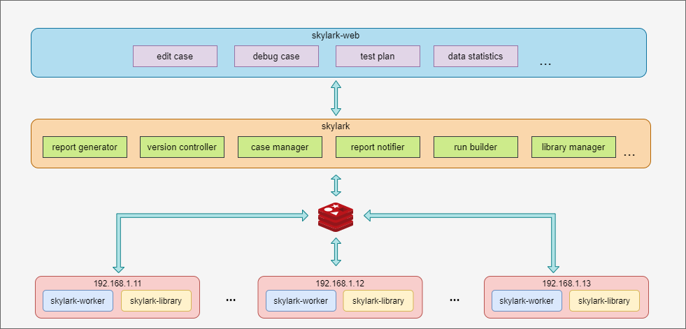

# 架构

> 更新时间：2023-12-08

### 整体框架

### 组成部分
综合多种因素考虑后，组成大概分为四个部分：
* [skylark-web](https://github.com/delav/skylark-web)：基于Vue开发的用户交互界面
* [skylark](https://github.com/delav/skylark)：基于Django开发的后端服务
* [skylarkworker](https://github.com/delav/skylarkworker)：专门用于执行测试任务
* [skylarklibrary](https://github.com/delav/skylarklibrary)：用于开发和迭代功能组件
