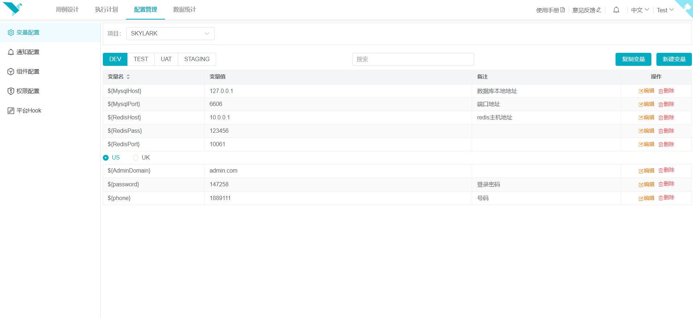

# 配置管理

> 更新时间：2023-12-08

### 功能总览
该项主要包括平台或项目的各种配置，包括项目变量配置、项目执行结果通知配置、项目(团队)用例组件配置，
项目权限配置、以及平台钩子配置。

#### 变量配置
变量配置管理可以更加清晰的通过项目、环境、地区管理变量，支持根据环境、地区批量复制功能，确保项目在各个环境的配置变量一致。

#### 通知配置
通知配置可以设置各个项目的测试执行结果通知，支持企业微信群、钉钉群、飞书群、邮件通知。仍不满足可以在后端接入更多的通知方式。

#### 组件配置
组件配置是管理平台组件的模块，只能修改更新用户所在组的平台组件。当需要添加新组件，可以在`skylarklibrary`
仓库对应的团队目录下增加新的函数（方法），提交合并到主分支，即可通过`扫描组件`获取，确认组件之后就可以在测试用例中使用。

#### 权限配置
权限配置用于管理项目的权限。新建项目时若公开项目则默认同组用户拥有权限，私有项目公开后将不再可以设置私有。

#### 平台Hook配置
平台Hook使得可通过接口的方式让平台执行相应的功能，如计划构建、代码合入等。

