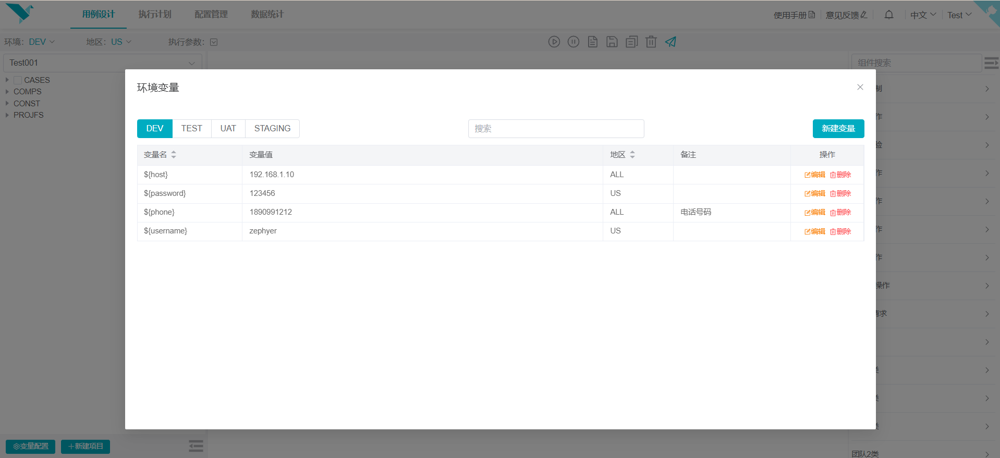
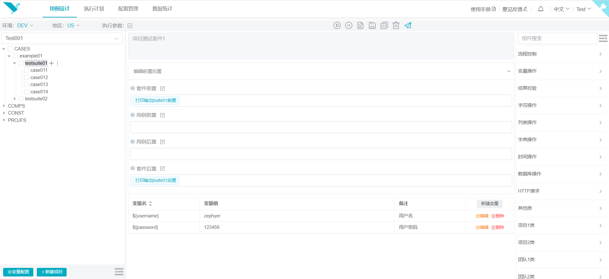
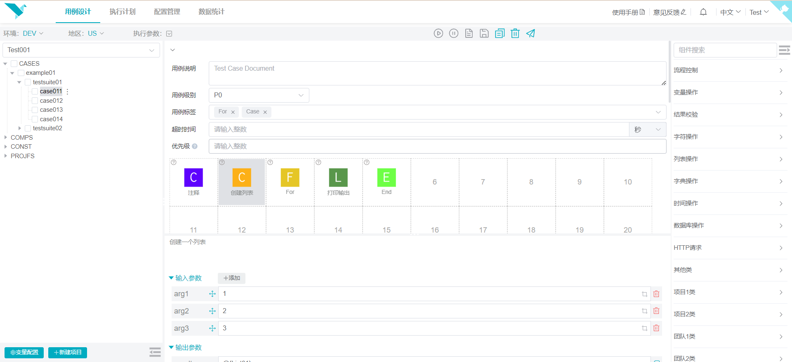
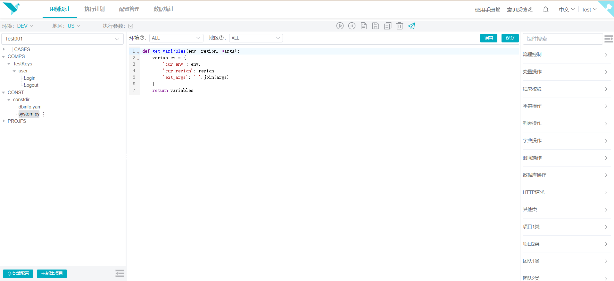
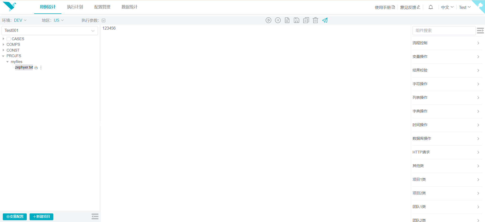

# 用例设计

> 更新时间：2023-12-16

### 功能总览
顶部为功能操作栏， 左侧为项目树管理， 中间为节点编辑区， 右侧为用例组件区

### 创建项目
创建项目非常简单，填写项目名称即可，支持项目私有或公开，私有项目只有创建者或管理员有权限，公开的项目默认同组用户拥有相同的权限。
同时，也支持创建项目时复制已有的项目。

### 变量设置
为该项目设置公共的变量，可在项目中直接使用，也可以在【配置管理】中设置和操作。

### 项目编辑
项目是树形结构，根节点类型固定为四种：CASES(测试用例)、COMPOS(高级自定义组件)、CONSTS(常量)、PROFILES(项目文件)
根节点下又分为多种不同类型的节点，每种类型的节点都有不同的功能。
::: tip 说明
节点名称非固定，可以修改。
:::

#### CASES根节点
CASES根节点下的子节点分为三种类型：用例目录、测试套件、测试用例。

#### 用例目录
用例目录节点下可创建子目录和测试套件，支持将其他目录的测试套件复制粘贴到该目录。用例目录的功能可以为该目录下的所有测试套件和测试用例设置测试前置、后置步骤。

#### 测试套件
测试套件节点下可创建测试用例，支持复制测试套件和粘贴其他测试套件的测试用例。测试套件的功能可以为该套件和套件下的所有测试用例设置测试前置、后置步骤，此外，
还可以为套件设置变量（该测试套件下生效）。

#### 测试用例
测试用例节点是最重要的节点，是自动化测试用例的载体，同样功能也是最多的，包含测试用例的各类设置和实际内容。

用例基本设置：
* 用例级别：就是测试用例的基本信息，体现一个测试用例的重要程度。
* 用例标签：可以为测试用例打上各种标签，方便区分和筛选。
* 超时时间：测试用例执行的最长时间，执行超出设置的时间则判为执行失败。
* 优先级：该测试套件下测试用例执行的优先级，数字为整数，数字越小，优先级越高，用于设置测试用例的执行顺序。

用例内容编辑：
测试用例内容由组件（用例的最小单位）构成。组件有名称、描述、输入参数、输出参数等属性。在测试用例编辑中只有输入参数和输出参数
是可编辑属性，使用组件时只需填写这两个参数即可。
::: tip 说明
测试用例有任何改动，顶部工具栏的`【保存修改】`按钮都会变亮，修改后点击保存即可。亦可编辑后直接运行调试，调试通过后再保存（可实现多人同时编辑调试同一个测试用例）。
:::

1.添加新组件
* 鼠标置于右侧组件的图标上，直接拖动到用例编辑区域上，可以放于任意位置。
* 鼠标置于右侧组件中间，然后双击，组件就会添加到用例的末尾位置。

2.交换组件位置

可直接拖拽组件进行任意位置的交换

3.复制组件
* 单个组件复制。单击需要复制的组件，顶部工具栏的的`【复制组件】`按钮图标变亮，点击按钮即可完成复制。
* 多个组件复制。单击需要复制的起始组件，然后按下`Ctrl`或者`Shift`键，再单击其他组件，这样完成多个组件的选中后，再点击`【复制组件】`按钮， 即可完成批量复制。

4.粘贴组件

在完成组件复制操作后，然后在需要插入的位置单击即可完成粘贴操作。

5.删除组件

可单个或多个删除，使用`3.复制组件`中的操作选中组件，然后单击顶部工具栏的`【删除组件】`按钮或者按下`Delete`键即可删除。

6.组件参数

组件的输入输出参数完全有组件本身的功能决定。没有输入参数、固定个数的输入参数、动态个数的输入参数都有。根据组件的具体描述
来填写即可。组件的输出参数可以在用例的后续组件中使用。

::: tip 说明
组件的输出参数即为变量，但是只能在该用例的后续组件中使用，若有多个相同的名称，后面的会覆盖前面的变量。
:::

#### COMPOS根节点
COMPOS根节点下的子节点同样分为三种类型：组件目录、组件套件、测试组件。 组件目录和组件套件没有太多功能，测试组件和测试用例类似。

#### 测试组件
测试组件的功能是封装更高级的组件，以便在测试用例中更便捷的使用，减少冗余重复的步骤。可以设置它的输入输出参数，跟基础组件有类似的功能。

::: tip 说明
COMPOS下的组件都会新增到右侧组件库的`平台组件`中，可直接在测试用例中使用。
:::

#### CONSTS根节点
CONSTS根节点下的子节点分为两种类型：变量目录、变量文件。 变量文件支持python和yaml文件格式。

#### 变量文件
变量文件，顾名思义，就是为项目设置变量（也可以在变量配置中设置）。这是为了支持某些根据环境、地区、特殊情况而动态
设置变量。同时，还可以为变量文件设置对应的环境和地区。

#### PROFILES根节点
PROFILES根节点下的子节点也分为两种类型：文件目录、项目文件。 项目文件是用户上传的实际文件。 只支持显示部分格式的文件内容。
不支持直接修改，如果需要修改，可先下载到本地，修改以后再上传。

