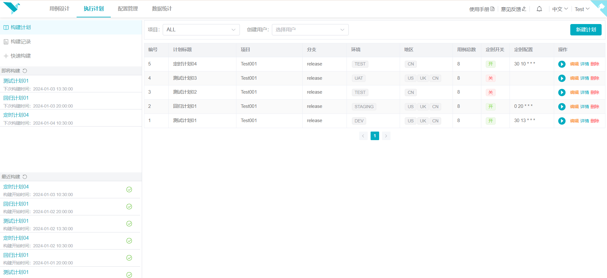
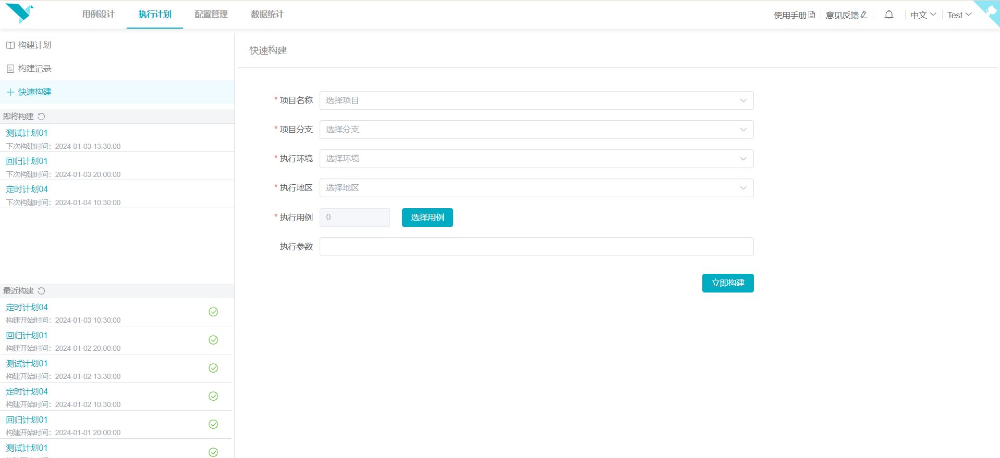
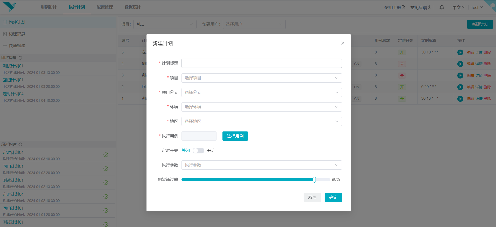
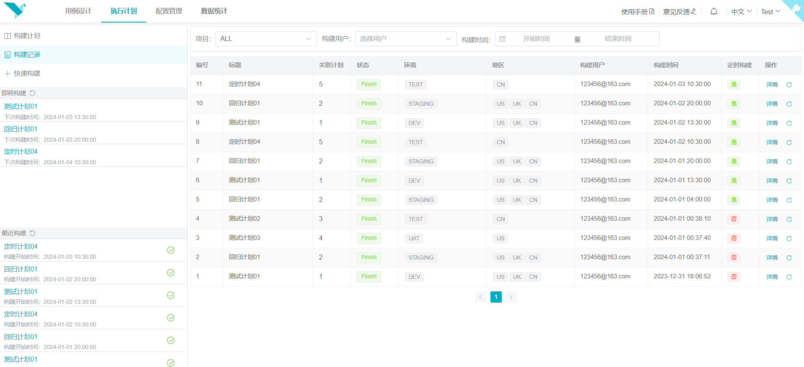

# 执行计划

> 更新时间：2023-12-08

### 功能总览
左侧分别为导航栏、即将执行的定时任务列表和最近的执行记录。右侧为执行计划列表。管理执行计划和执行记录的模块。

#### 快速构建
快速构建是不需要新增测试计划，就可以直接执行，只需要填写必须参数即可。

#### 执行计划
执行计划是管理项目执行的模块，包括基本的新建、更新、删除功能，也可以直接执行已有计划。

#### 执行记录
执行记录是管理项目计划执行记录的模块，一条执行记录可能包含多个环境、地区的执行历史。

